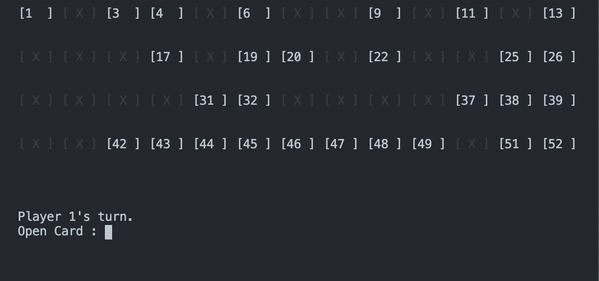

# Memory Card Game

### Running the game

`python3 memory-card-game/main.py`

Optional arguments include:

`--players int`

> _number of players. default is 1_

`--timeToMemorize int`

> _seconds until unmatched board clears. default is 2_

`--cardsInRow int`

> _number of cards in a row. default is 13. Change to set the newline breakpoint of the row_

### Warning

To prevent cheating by scrolling up to the previously printed boards, the text of terminal is regularly cleared and scroll is prevented. Please run the game in a terminal you do not need reference for.

### Controls

The board displays shuffled deck of 52 cards.
A card without a suit displayed and of default text color represents face-down card.
Open a card in console by inputting the number of the face-down card.

A card with a suit and value displayed and of red color (may be different based on machine's terminal theme) represents face-up card.

If a player matches card values successfully (suits do not matter), the matched cards are marked with `[ X ]` and greyed out.
The player earns a point and can make successful turn until the player fails to match.

If number of players exceed 1, the turn is given to the next player.

The game completes when the entire board has been matched.
In multiplayer setting, win the game by having the most points.

`Ctrl C` or `Ctrl D` anytime to terminate.

### Program Structure

Simple MVC pattern is followed, where methods to manipulate reside inside the respective model classes and are called upon by the controller to manipulate the model. After the model has been edited, the controller calls upon the view which parses the model to display the view.

Python selected for non-verbose setup.
